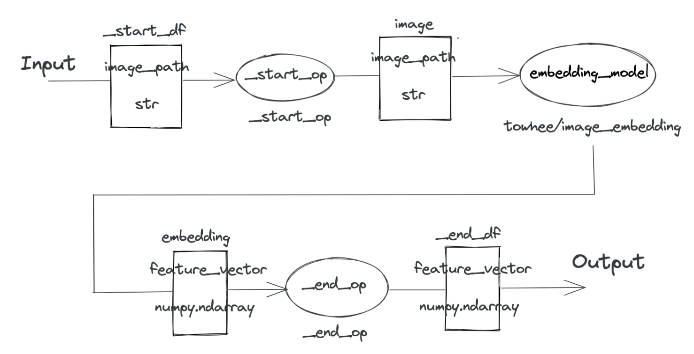

# Pipeline: Image Embedding using Resnet50

Authors: derekdqc

## Overview

The pipeline is used to **extract the feature vector of a given image**. It uses Resnet50 model to generate the vector.

## Interface

**Input Arguments:**

- img_path:
  - path to the input image
  - supported types: `str`

**Pipeline Output:**

The pipeline returns a tuple `Tuple[('feature_vector', numpy.ndarray)]` containing following fields:

- feature_vector:
  - the embedding of input image
  - data type: `numpy.ndarray`
  - shape: (2048,)
## How to use

1. Install [Towhee](https://github.com/towhee-io/towhee)

```bash
$ pip3 install towhee
```

> You can refer to [Getting Started with Towhee](https://towhee.io/) for more details. If you have any questions, you can [submit an issue to the towhee repository](https://github.com/towhee-io/towhee/issues).

2. Run it with Towhee

```python
>>> from towhee import pipeline

>>> embedding_pipeline = pipeline('towhee/image-embedding-resnet50')
>>> embedding = embedding_pipeline('path/to/your/image') #such as './readme_res/pipeline.png'
```

## How it works

This pipeline includes one operator: [image embedding](https://hub.towhee.io/towhee/image-embedding-operator-template) (implemented as [towhee/resnet-image-embedding](https://hub.towhee.io/towhee/resnet-image-embedding)). The image will be encoded via image embedding operator, then we can get a feature vector of the given image.


> Refer [Towhee architecture](https://github.com/towhee-io/towhee#towhee-architecture) for basic concepts in Towhee: pipeline, operator, dataframe.


